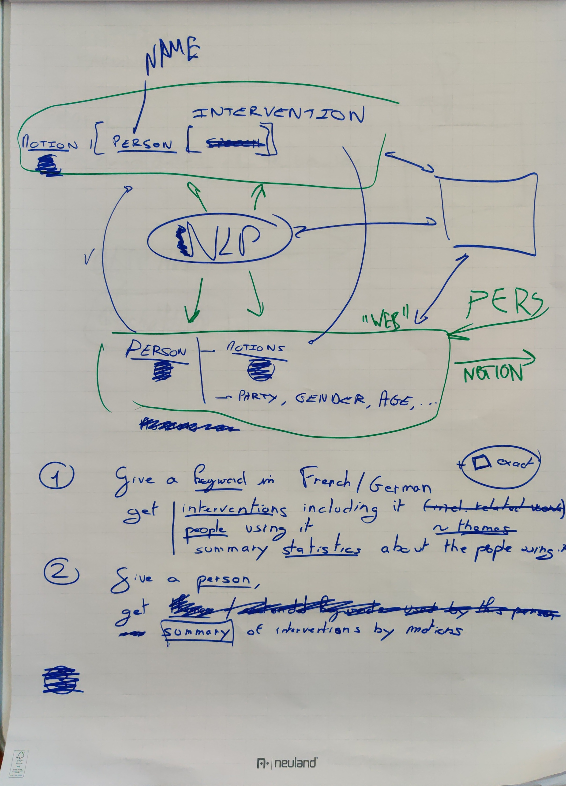
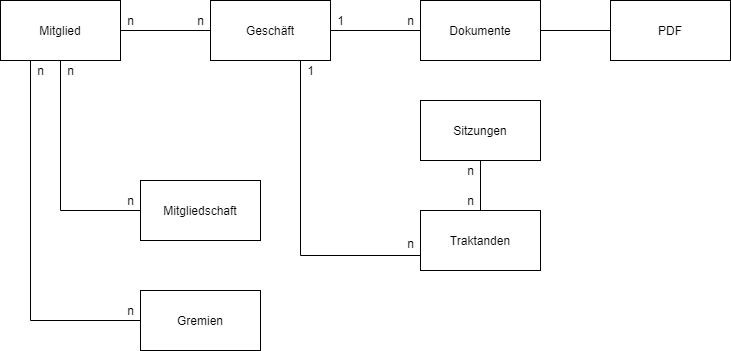

### About

This repository represents and attempt to create easily available analytics from the diligent recording of the proceedings in the Grossrat of the Canton Berne.
The findings and software are provided 'as is' and show mostly how with very little effort great value, public accountability and transparency could be created by the council.

The data in this repository may not be used or distributed without the consent from the Grossrat of the Canton Berne.

All analytical results are to be taken as incomplete and unreliable due to the small sample size.

### Idea

### Meta Data Model

